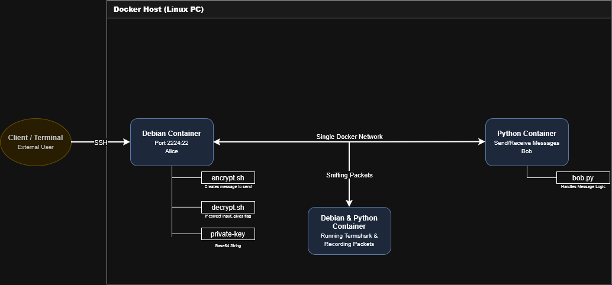

In this inital design, Hackerbot9001 was an extra device on the network and sniffing all packets being transmitted.
Due to logics and permissions issues, Hackerbot was moved from a listener to a proxy as seen in the new diagram.
This transformed the simulation from someone listening in, to a targetted Man In The Middle (MITM) attack.
