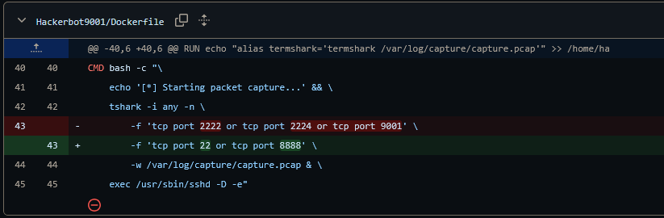
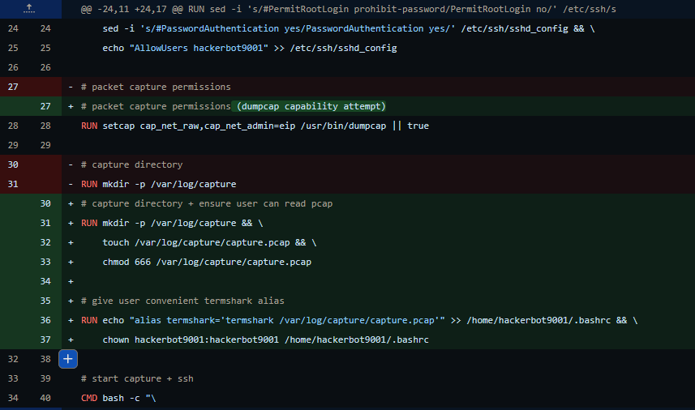

11/06/2026

Initially I designed hackerbot to capture all traffic on all open ports.
At this point that would have been 22, 2222 and 2224 for ssh, and 8888 for netcat (initially I had it at 9001 and realised it might confuse bob for hackerbot).
As seen in this image, I realised that this was not how the ports were operating as I forgot to account that ports 2222 and 2224 were being mappes to 22 for each container respectively, and ended up capturing either wrong packets or nothing.

In the initial design for hackerbot I was planning to have an alias that running the termshark command would open a hidden .pcap file instead of opening a new instance. This came about as I kept running just the termshark command and starting a new instance, then wondering why I could not see any of my transmitted packets.
Later I figured it would be easier to put the .pcap file in the home directory and allow the user to run termshark to read live packets, or read the existing .pcap. This allows for logging back into alice, generating live traffic and observing what happens.

