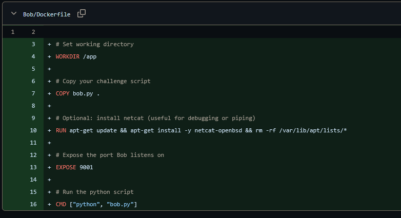
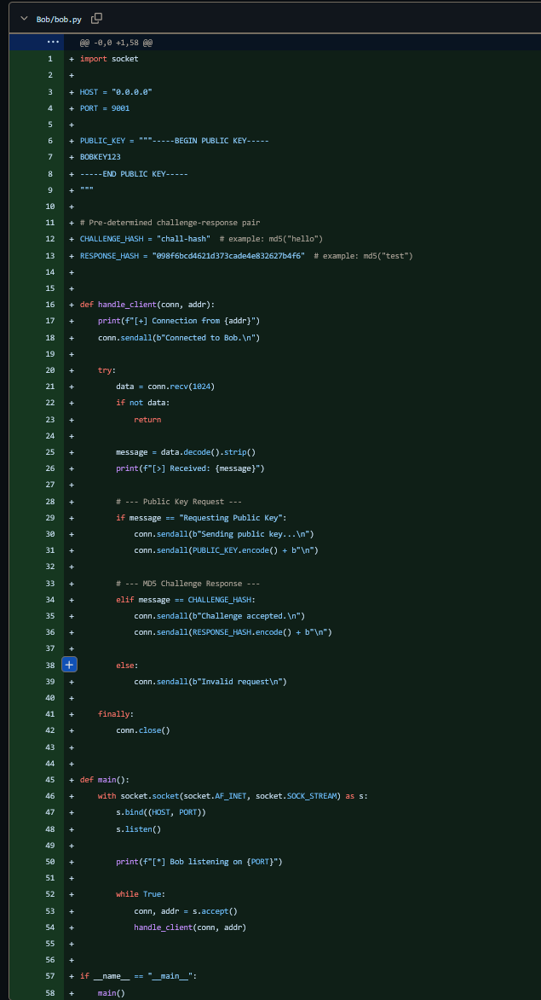

3/6/2026

Bob now works and runs. Alice can netcat into Bob and reliably get a reply

Bob's public key and the placeholders for later hashs (as part of communications with alice) are present. While these will change, they will be pre-prepared before final launch.
